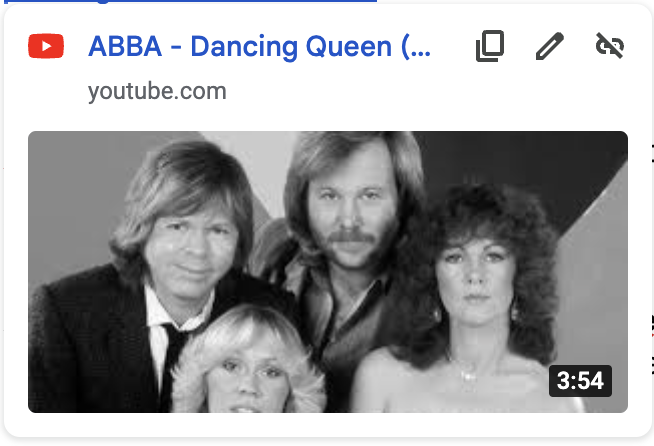

[Dancing Queen Instrumental](https://www.youtube.com/watch?v=nSsRbv7ockI)

Opening:  
OOOOOHHH Heyyyyy Jill- grab your tiniiii, its time to parrrrrrtyy  
Oooohhh she’s sixty \- loves her E, she is the birthday queeeeen

VERSE 1:  
Just a girl from Baltimorrrre   
Always dreamed of something moreeeeeeeee  
Met her Prince Eric, he bought blue jeans, she had him beggin’ pleassssee \[repeat: beggin’ please\]

Not anyone could be that guy   
His love was getting her, highhhhhhhh  
Tied the knot at Woodholme,   
Moved in \- to Greentree   
Then came 1, 2, 3 \- 1, 2, 3

And she loves to danceeeeeeee

\[Chorus\]   
She is the birthday queen   
Young and sweet, only sixtyyyyyyyyyyy  
Birthday queen   
Fun and chic \- being with hers a treat, oh yeah 

Heyyyyy Jill- grab your tiniiii, its time to parrrrrrtyy  
Oooohhh she’s sixty \- loves her E, she is the birthday queeeeen

\[Verse 2\]   
Admirals queen of the courtttt  
Party Hosting is her favorite spooort  
Holidays, birthdays, no time to sit, we’re always gettin’ lit…

And when the gummies hitttttttt

\[Chorus\]   
She is the birthday queen   
Young and sweet, only sixtyyyyyyyyyyy  
Birthday queen   
Fun and chic \- being with hers a treat, oh yeah 

Heyyyyy Jill- grab your tiniiii, its time to parrrrrrtyy  
Oooohhh she’s sixty \- loves her E, she is the birthday queeeeen

*Everyone Cheer and Dance\!*   
